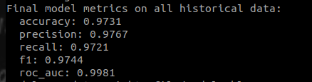
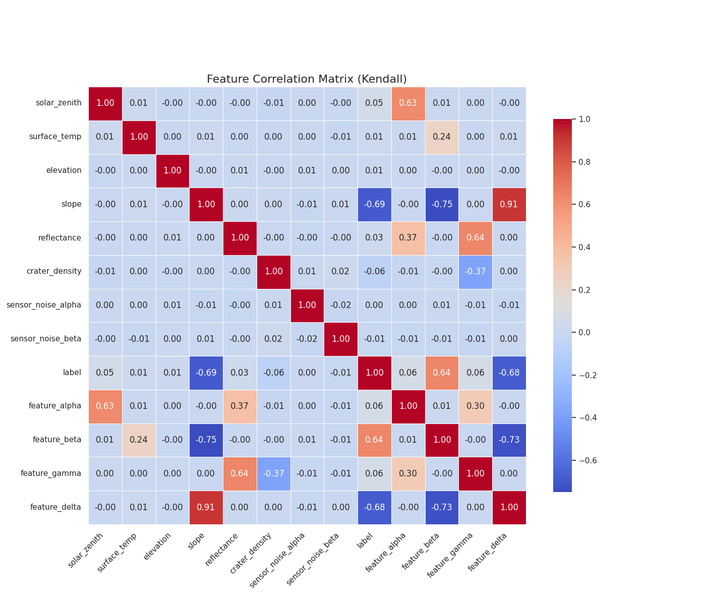
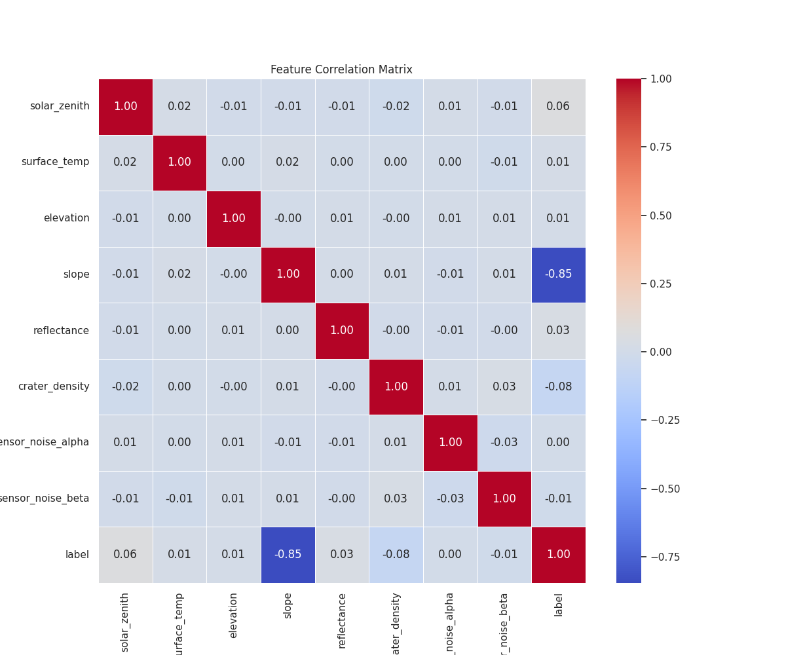
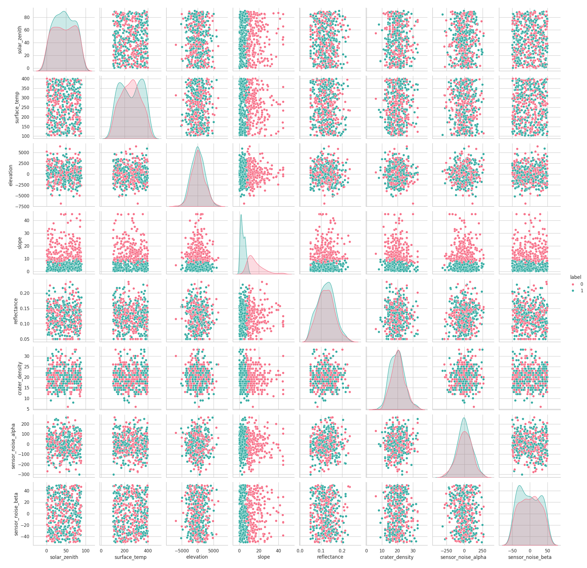

<h2>
CURRENT METRICS:

</h2>

<h2>Data Visualization: CHECKING THE DATASET</h2>
    acquired the dataset from get_previous_data() funcction from lunadem. and saved it as data.csv

    got the following plots in data: 
<!-- Resize an image -->

Pearson Correlation Matrix

<!-- Center an image -->
Kendall Correlation Matrix
  

<!-- Center an image -->
Spearman Correlation Matrix
  

<!-- Center an image -->
Features Pairplot
  

# Task 3: Lunar Terrain Classification

Please mention your approaches and observations about the data below:

## Approaches

I first collected the historical lunar terrain data using `lunadem.get_previously_available_data()`. This gave the 8 raw sensor variables: `solar_zenith`, `surface_temp`, `elevation`, `slope`, `reflectance`, `crater_density`, `sensor_noise_alpha`, and `sensor_noise_beta`. After that I used the 4 LinaDEM feature extraction functions to add `mineral_index`, `thermal_inertia`, `albedo_ratio`, and `regolith_depth`, so the model was trained on the required 12-feature dataset.

After exploring the visualizations and correlation matrices, I did not treat all variables in the same way. Some variables had almost uniform distributions, such as `surface_temp`, `solar_zenith`, and `sensor_noise_beta`. `slope` looked closer to an exponential distribution. `elevation` and `reflectance` were right-skewed, while `crater_density` and `sensor_noise_alpha` looked closer to normal distributions. Based on this, I added extra transformed features such as `slope_log`, `slope_sqrt`, `slope_sq`, `reflectance_log`, and `elevation_abs`.

The strongest relationship I found was between `slope` and the terrain label. The Spearman correlation between `slope` and `label` was around `-0.85`, showing a strong monotonic negative relation. From the `slope_label.py` plot, I also observed that when `slope > 14`, the label was always `0` in the historical data. To make this relationship easier for the model to learn, I added threshold and margin features such as `slope_gt_13`, `slope_gt_14`, and `slope_margin_13`.

I also added interaction features involving slope, because slope appeared to control a large part of the decision boundary. For example, I added `slope_x_reflectance` and `slope_x_crater_density` so the model could learn combined effects instead of only independent feature effects.

For the model, I used a soft-voting probability ensemble instead of a single hard classifier. Since the final metric uses ROC-AUC, the model should output probabilities rather than only `0` or `1` labels. The ensemble combines quantile-transformed logistic regression, spline logistic regression, a small neural network, an SVC probability model, and AdaBoost. This improved validation ROC-AUC and accuracy compared with the earlier AdaBoost-only approach.

The final prediction pipeline is shared across training, evaluation, and live inference. `train.py` trains the model and saves it to `weights_file/model.pkl`, `evaluate.py` reads a CSV and writes probability predictions, and `test.py` runs the same model on live data from `lunadem.get_current_data()`.

## Observations

- `slope` is the most important visible feature because it has a strong negative relationship with the label.
- The rule `slope > 14 -> label 0` appeared consistently in the historical dataset.
- `feature beta` is surface_temp/(1+slope)
- `feature delta` is ln(1+|elevation|)*slope
- `feature delta` is another important visible feature because we find that it segregates the label into two classes based on its range.
- The target classes are fairly balanced, so accuracy is meaningful, but ROC-AUC is still better for judging probability ranking.
- The correlation matrices showed that not every feature has a strong linear relationship with the label, so nonlinear transformations and interactions were useful.
- Because ROC-AUC evaluates ranking quality, the final output is the probability of class `1`, not a boolean class label.
- The model was validated using `lunadem.predict_label()` as the internal reference engine.
