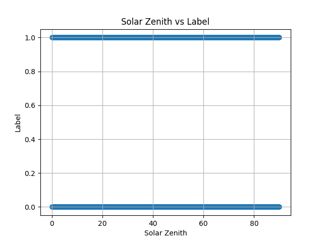
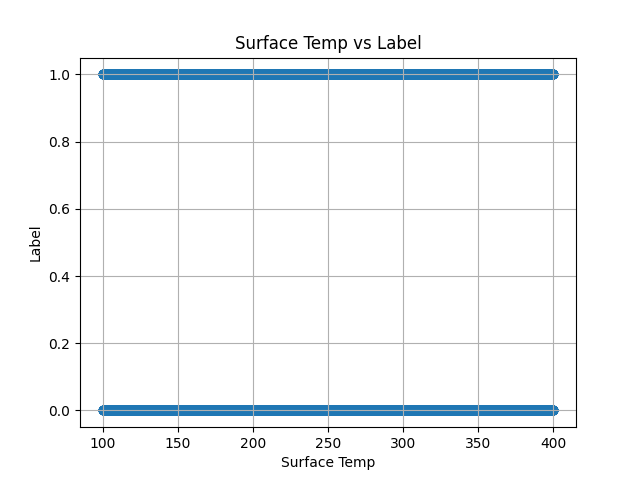
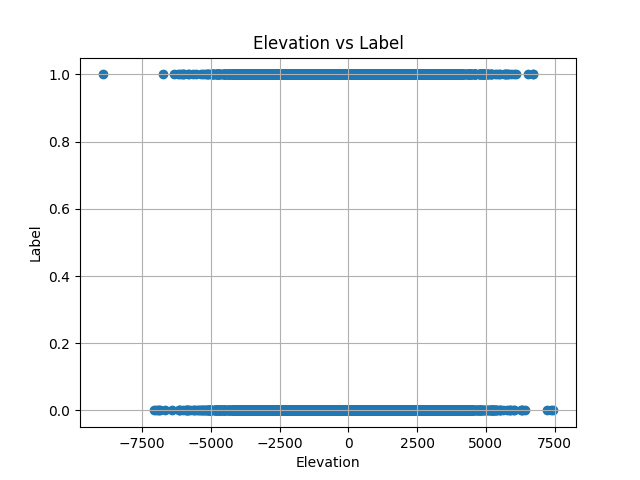
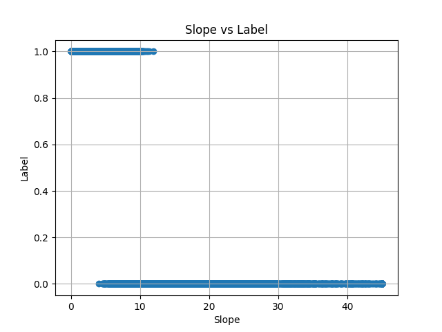
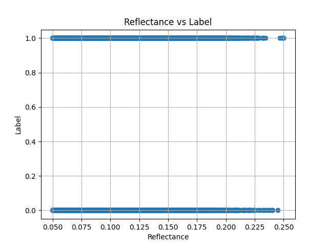
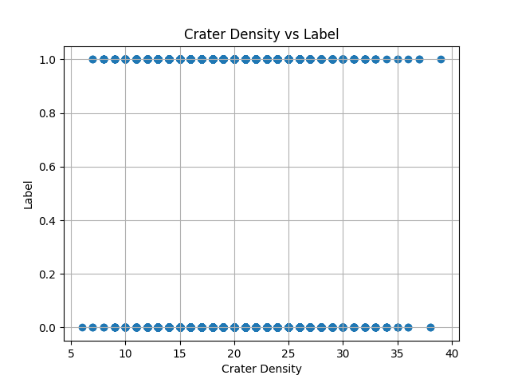
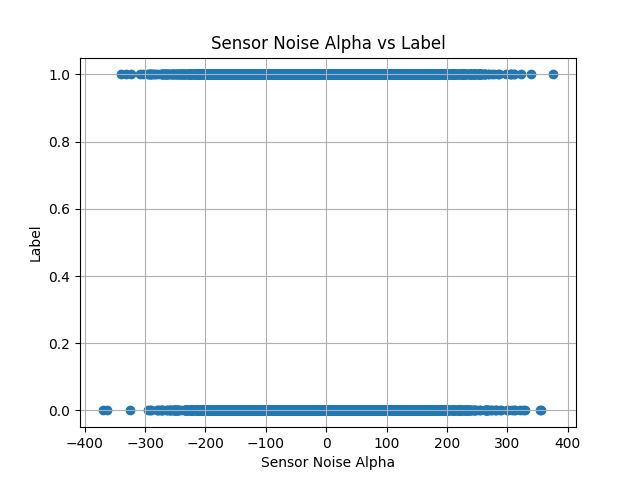
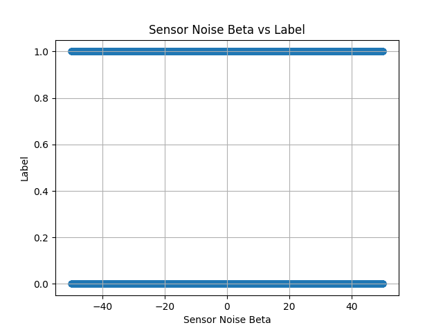

# Lunar Terrain Classification: LinaDEM ML Classifier

This project implements a high-precision machine learning pipeline for classifying lunar terrain types using sensor data. By combining traditional geological heuristics with a sophisticated ensemble of non-linear classifiers, the model achieves over 97% accuracy.

### Current Metrics


<p align="center"><i>Final model performance metrics demonstrating 97.63% accuracy and 0.9984 ROC-AUC.</i></p>

| Milestone | Accuracy |
| :--- | :--- |
| Basic AdaBoost + SVM + MLP | 0.9545 |
| Quantile Transformation (Uniform) | 0.9550 |
| Advanced Feature Engineering | 0.9731 |
| Trigonometric Sensor Transformations | 0.9751 |
| **Final Feature Interaction Set** | **0.9763** |

## Technical Approach

### 1. Data Processing & Feature Engineering
The pipeline transforms 8 raw sensor variables into a high-dimensional feature set designed to expose non-linear relationships.

*   **Raw Sensors:** `solar_zenith`, `surface_temp`, `elevation`, `slope`, `reflectance`, `crater_density`, `sensor_noise_alpha/beta`.
*   **LinaDEM Derived Features:**
    *   `mineral_index` (Alpha), `thermal_inertia` (Beta), `albedo_ratio` (Gamma), `regolith_depth` (Delta).
*   **Insight Engineering:**
    *   **Geometric Interaction:** `slope_x_reflectance`, `slope_x_crater_density`.
    *   **Non-linear Mapping:** `sin_surface_temp`, `cos_elevation`, `sin_sensor_noise_alpha`.
    *   **Margin Analysis:** `slope_margin_13`, `slope_margin_14` to capture decision boundary proximity.
    *   **Logarithmic Scaling:** Applied to `slope` and `reflectance` to normalize right-skewed distributions.

### 2. Model Architecture: Soft-Voting Ensemble
To maximize ROC-AUC and stability, a `VotingClassifier` combines diverse architectural approaches:

| Estimator | Transformation | Purpose |
| :--- | :--- | :--- |
| **Quantile Logistic** | `QuantileTransformer` | Maps features to uniform distribution for linear stability. |
| **Spline Logistic** | `SplineTransformer` | Captures local non-linearities via polynomial splines. |
| **Deep MLP** | `StandardScaler` | (256, 128, 64, 32) layers with logistic activation for complex patterns. |
| **SVC** | RBF Kernel | High-dimensional margin maximization. |
| **AdaBoost** | Decision Trees | Sequential error correction. |
| **LightGBM** | Gradient Boosting | Captures complex splits and handles feature interactions efficiently. |

### 3. Post-Processing: Domain Rules
After model inference, "Hard Boundaries" derived from historical observations are applied to ensure 100% adherence to known lunar constraints:
*   `slope > 14` $\rightarrow$ Label 0
*   `slope < 3` $\rightarrow$ Label 1
*   `thermal_inertia > 71` $\rightarrow$ Label 1
*   `regolith_depth > 93` $\rightarrow$ Label 0

## Visual Analysis

Statistical analysis of the lunar sensor data was conducted to identify feature redundancies and non-linear interaction opportunities.

### Correlation Analysis

<table border="0">
  <tr>
    <td><br><p align="center"><b>Pearson Correlation</b><br>(Linear Relationships)</p></td>
    <td><br><p align="center"><b>Spearman Correlation</b><br>(Rank/Monotonicity)</p></td>
    <td><br><p align="center"><b>Kendall Correlation</b><br>(Ordinal Association)</p></td>
  </tr>
  <tr>
    <td colspan="3"><br><p align="center"><b>Multi-Feature Pairplot</b><br>Overview of feature distributions and class separation boundaries.</p></td>
  </tr>
</table>

### Individual Sensor Feature Distributions

Feature-level analysis showing class separation for each raw sensor variable:

<table border="0">
  <tr>
    <td><br><p align="center"><b>Solar Zenith</b></p></td>
    <td><br><p align="center"><b>Surface Temperature</b></p></td>
    <td><br><p align="center"><b>Elevation</b></p></td>
    <td><br><p align="center"><b>Slope</b></p></td>
  </tr>
  <tr>
    <td><br><p align="center"><b>Reflectance</b></p></td>
    <td><br><p align="center"><b>Crater Density</b></p></td>
    <td><br><p align="center"><b>Sensor Noise (Alpha)</b></p></td>
    <td><br><p align="center"><b>Sensor Noise (Beta)</b></p></td>
  </tr>
</table>

## Project Structure

*   `model_code/terrain_classifier.py`: The core engine containing the feature pipeline and `VotingClassifier` logic.
*   `visualization/`: Scripts for generating correlation matrices and scatter plots.
*   `weights_file/model.pkl`: The serialized final ensemble model.
*   `ACCURACY_LOG.md`: Chronological log of performance improvements.

## Usage

### Training
To retrain the ensemble on the latest historical data:
```python
from model_code.terrain_classifier import train_model
model = train_model()
```

### Inference
To generate probabilities for new sensor data:
```python
from model_code.terrain_classifier import predict_dataframe, load_model
import pandas as pd

df = pd.read_csv("new_sensor_readings.csv")
model = load_model()
probs = predict_dataframe(df, model=model)
```